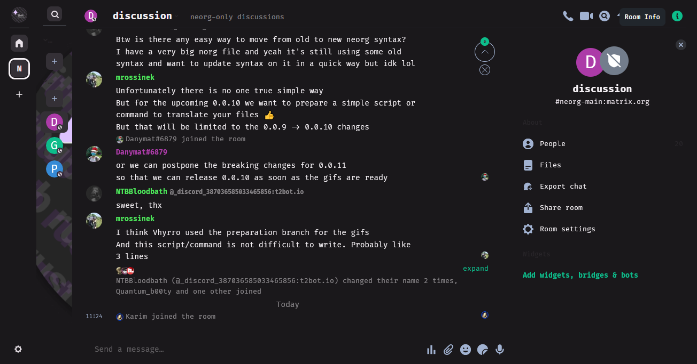

# kurai.element
dark colorscheme for [element](https://element.io)

# usage
Follow [instructions](https://github.com/aaronraimist/element-themes), but use link to [kurai.json](https://raw.githubusercontent.com/kurai-theme/kurai.element/main/kurai.json) as colorscheme file.

